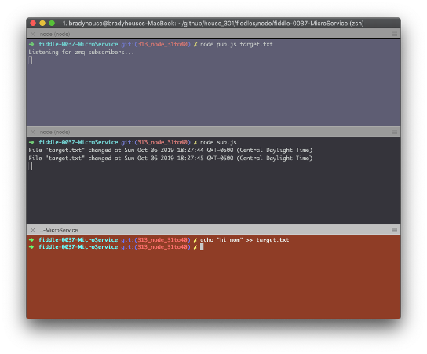

fiddle-0037-ZmqPubSub
======

### Title 

ZeroMq ~ Pub/Sub Pattern

### Author 

bradyhouse@gmail.com

### Creation Date 

10-03-19

### Location 

Chicago, IL

### Issue 

[Issue 301](https://github.com/bradyhouse/house/issues/301)

### Description 

What are the building blocks of a node networking `MicroService` module? First ingredient, messaging. Time to revisit [0MQ](https://www.npmjs.com/package/zeromq). Specifically, a refresher in the pub/sub pattern is a good starting point. [Fiddle #34](../fiddle-0034-TcpSocketClient) can be rewritten (or simplified) using 0MQ to implement a pub/sub design pattern.

__Note, this fiddle adapted from the example given in Chapter 4 of Jim Wilson's book, [Node.js 8 the Right Way](http://www.pragmaticprogrammer.com/titles/jwnode2).__

### Use Case

1.  Open a console and navigate to the fiddle's root directory
2.  Enter the command `npm install`
3.  Enter the command `node pub.js target.txt`
4.  Open a second console and navigate to the fiddle's root directory
5.  Enter the command `node sub.js`
6.  Open a third console and navigate to the fiddle's root directory
7.  Enter the command `echo "hi mom" >> target.txt"`

### Tags 

node.js, hamony, process, argv, fs, zeromq, pub/sub
